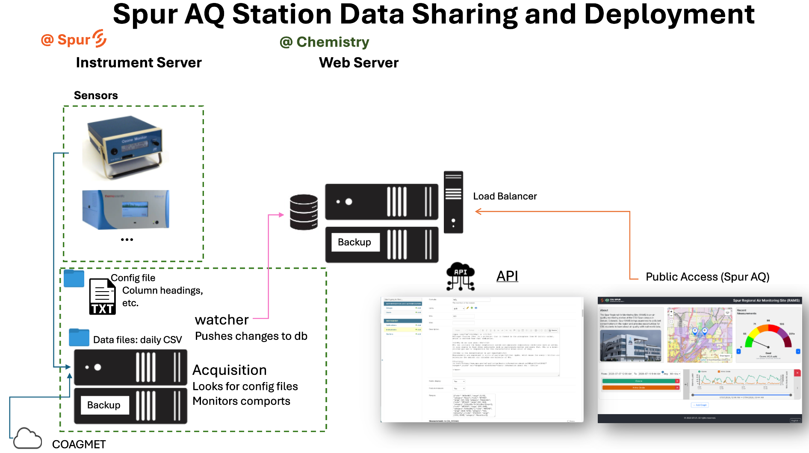

# Instrument Data Platform

The Instrument Data Platform provides a complete pipeline for acquiring,
monitoring, serving, and visualizing instrument data.

Each component of this system is developed and maintenaint independantly, but together allow data to move from the instument comport to the webserver.

## Overview

The Instrument Data Platform is deployed across two primary servers: an **instrument server** and a **web server**.

The instrument server is equipped with 10 serial (COM) ports to accomodate additional instruments.

The `instrument_data_acquisition` application continuously communicates with connected instruments, synchronizes data collection, and monitors instrument status to detect communication outages. Measurements are stored in separate daily data files for reliable archival and efficient data management.

The `instrument_data_watcher` service monitors newly acquired data and automatically uploads it to the central database.

The `instrument_data_api` application provides a REST API for managing instrument metadata, configuration, and access to collected measurements. The `spur_aq` web application provides a public-facing interface where users can explore air quality data over time, visualize trends, and learn more about the available measurements.

The overall architecture of the platform is illustrated in the figure below.





## Repository Structure

```
instrument_data_platform
├── acquisition
├── api
├── watcher
└── spur_aq
```

Each component is included as a Git submodule and retains its own release
cycle and version history.

## Cloning

Clone the repository together with all submodules:

```bash
git clone --recurse-submodules \
https://github.com/GeospatialCentroid/instrument_data_platform.git
```

If you have already cloned the repository:

```bash
git submodule update --init --recursive
```

## Updating Components

To update all submodules:

```bash
git submodule foreach git pull origin main
```

After updating, commit the new submodule references:

```bash
git add .
git commit -m "Update platform dependencies"
git push
```

## Development

Each component can be developed independently within its own directory.

Changes to a component should be committed to that repository first. Then
commit the updated submodule reference in this repository.